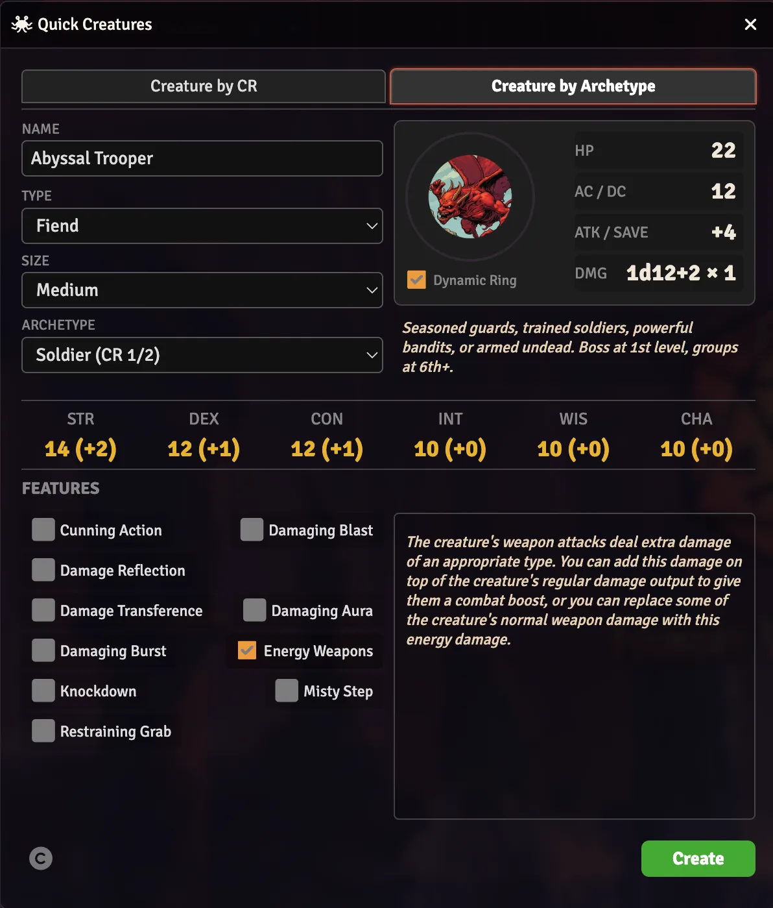
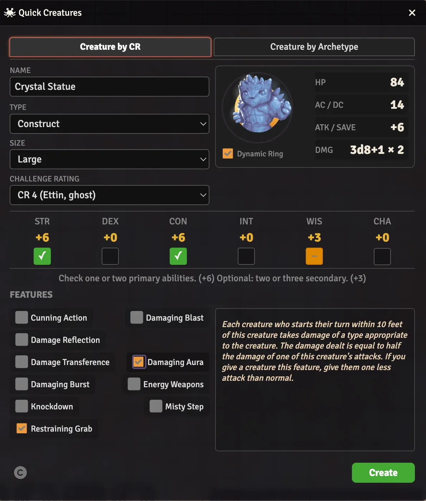

# Quick Creatures

> **⚠️ Disclaimer:** This module was created by an AI coding agent (Hephaestus, via Hermes Agent) under the direction of Jon Michaels. While tested and functional, users should verify behavior in their own games before relying on it in critical sessions.

Quickly generate custom monsters for **D&D 5E** and **Black Flag (Tales of the Valiant)**. Based on the [Lazy GM's 5e Monster Builder Resource Document](https://slyflourish.com/lazy_5e_monster_building_resource_document.html) (CC-BY 4.0). Select a Challenge Rating or archetype stat block, pick creature features, and create a fully-statted NPC in seconds.

## Screenshots

| D&D 5E | Black Flag (Tales of the Valiant) |
|--------|----------|
|  |  |

## Features

| Feature | Description |
|---------|-------------|
| **CR-based creation** | Select a Challenge Rating (0–30) — HP, AC, proficiency bonus, and attacks auto-calculated from the table |
| **Archetype stat blocks** | 7 pre-built archetypes (Minion → Champion) with themed ability scores and saving throws |
| **Monster features** | 10 creature features including damaging auras, breath weapons, energy weapons, Misty Step, and more |
| **Dual system support** | Same interface for D&D 5E and Black Flag — system adapter handles data model differences |
| **Creature tokens** | 14 Original Tokens from Lazy Monster Builder, 89 Cute Tokens, optional Dynamic Ring, and supported premium token sets including D&D Monster Manual, Tales of the Valiant Monster Vault 1 & 2, Pathfinder Tokens (Bestiaries, Monster Core 1 & 2), and Level Up: Advanced 5E Monstrous Menagerie. |
| **Drag-and-drop additions** | Drop weapons, features, and spells onto generated creatures to include them alongside Quick Creatures attacks and traits. |
| **Advanced mode** | Fine-tune HP, AC, damage, and ability values before creating the actor. |

## Installation

**In Foundry VTT:**
1. Go to **Add-on Modules** → **Install Module**
2. Paste the manifest URL: `https://github.com/jonmichaels/quick-creatures/releases/latest/download/module.json`
3. Click **Install**

**Manual:**
Download the [latest release](https://github.com/jonmichaels/quick-creatures/releases) and extract to `Data/modules/quick-creatures/`.

## Requirements

- **Foundry VTT** v13+ (verified through v14)
- **D&D 5E** (v5.0+) or **Black Flag Roleplaying / Tales of the Valiant** (v2.0+)

## What's New in v1.5.1

- Fixed Foundry v13 deprecation warnings by using the namespaced Handlebars template API.
- Improved Foundry Light theme styling for Quick Creatures stat panels, stat rows, feature selections, and selected item names.

## How It Works

1. Activate the module in your world
2. Open the **Actors** sidebar
3. Click the **Generate Creature** button next to "Create Entry"
4. Choose a tab: "Monster by CR" or "Monster by Archetype"
5. Select Creature Type, Size, CR, Abilities, and Features.
6. Click **Create**

The module uses a system adapter pattern — all actor creation routes through the active system's adapter, so the same interface works identically for both D&D 5E and Black Flag.

## Optional Token Set Support

Quick Creatures can use token art from installed token modules in addition to its bundled Original and Cute token sets. Open **Configure Token Sets** from the module settings to show or hide each source in the Token Sets pulldown.

| Token Source | Supported Art | Notes |
|--------------|---------------|-------|
| **D&D Monster Manual** | Portraits, flat tokens, Dynamic Ring subjects | Uses embedded Quick Creatures datasheet entries for Monster Manual creatures. |
| **Tales of the Valiant Monster Vault** | Portraits and flat tokens | Available for token selection even when the source module cannot be activated in the current system world. |
| **Tales of the Valiant Monster Vault 2** | Portraits and flat tokens | Available for token selection even when the source module cannot be activated in the current system world. |
| **Level Up: Advanced 5E Monstrous Menagerie** | Flat tokens | Supports Monstrous Menagerie 1 & 2 token directories when installed. |
| **Pathfinder Tokens** | Flat tokens | Supports Bestiaries, Monster Core, and Monster Core 2 when active. |

## Credits

This work includes material taken from the [Lazy GM's 5e Monster Builder Resource Document](https://slyflourish.com/lazy_5e_monster_building_resource_document.html) written by Teos Abadía of [Alphastream.org](https://alphastream.org), Scott Fitzgerald Gray of [Insaneangel.com](https://insaneangel.com), and Michael E. Shea of [SlyFlourish.com](https://slyfourish.com), available under a [Creative Commons Attribution 4.0 International License](https://creativecommons.org/licenses/by/4.0/).

Original Foundry VTT module: [Lazy Monster Builder](https://github.com/SetaSensei/lazy-monster-builder) by Seta Sensei. [CC-BY-4.0](https://creativecommons.org/licenses/by/4.0/)

[Cute Tokens](https://opengameart.org/users/justin-nichol) by Justin Nichol. [CC-BY-4.0](https://creativecommons.org/licenses/by/4.0/)

[Quick Creatures](https://github.com/jonmichaels/quick-creatures) by Jon Michaels. Coded by Hephaestus, a Hermes AI-Coding Agent.

## License

This module is available under the [Creative Commons Attribution 4.0 International License](http://creativecommons.org/licenses/by/4.0/).
